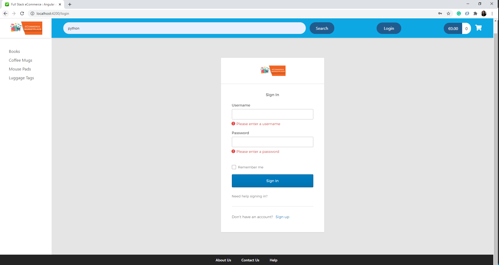
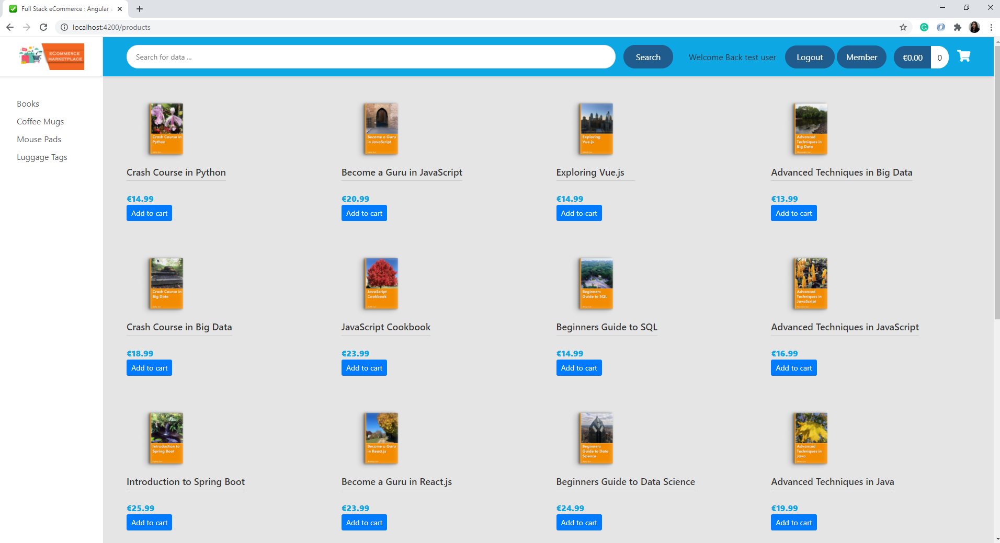
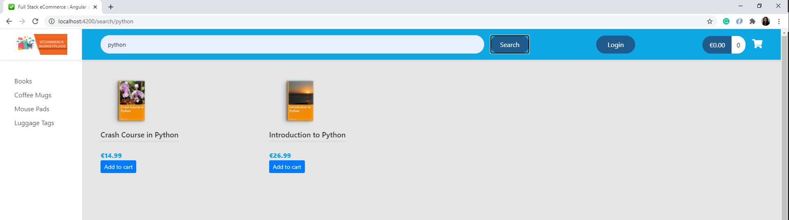
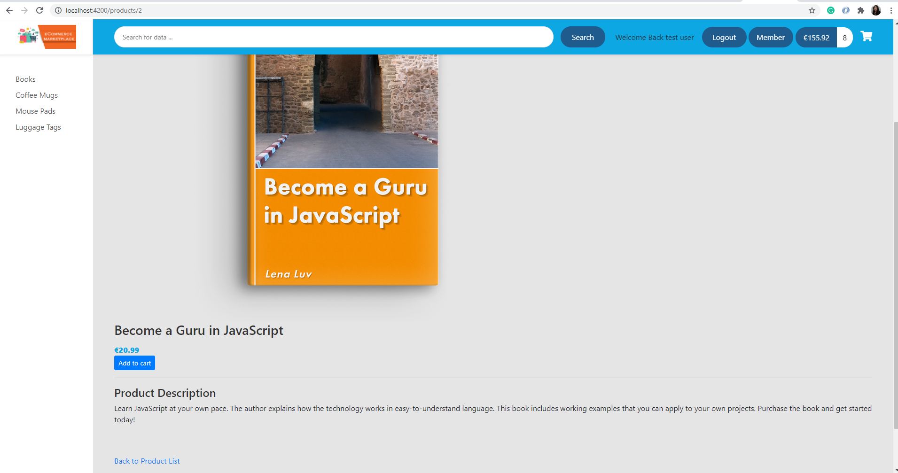
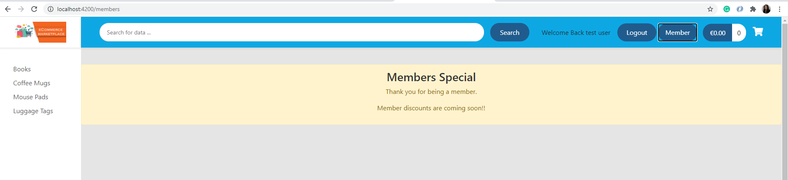
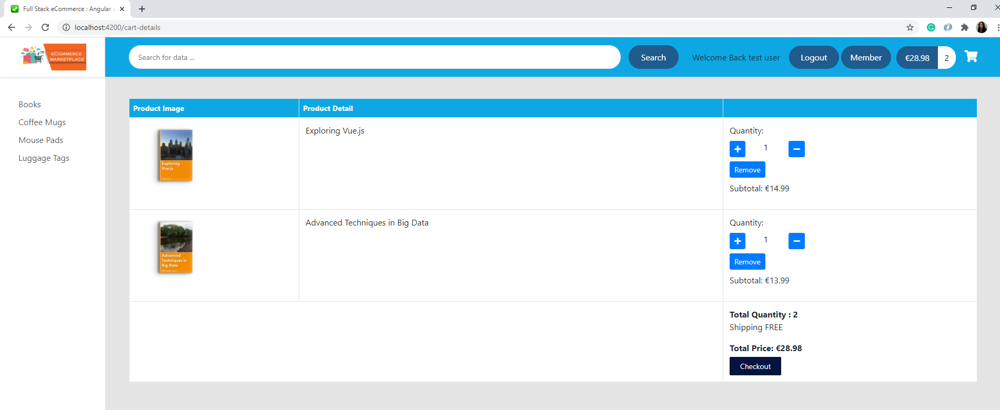
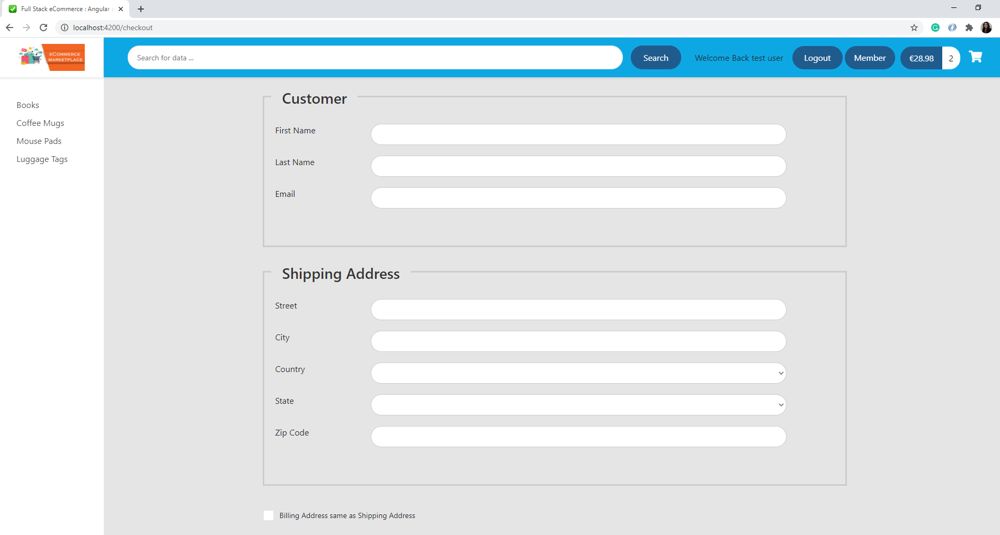
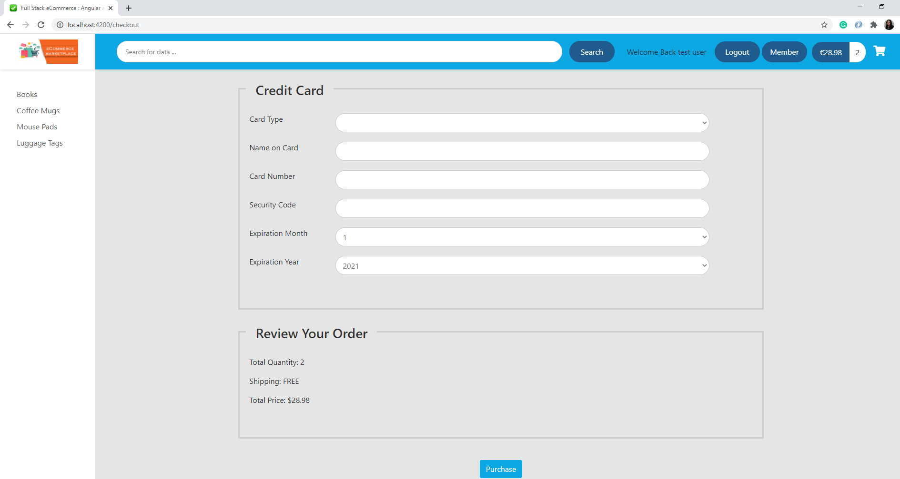
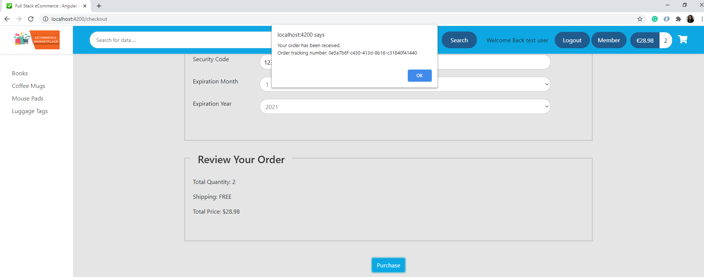

# Ecommerce Web application

This web application allow users to purchase products online.

This application built using Java 8, Spring WebMVC, Spring ORM, Hibernate, Lombok - You can find the backend source code here  https://github.com/OuniAbir/ecommerce-spring-backend

The frontend is built using Angular v11.

# Deploy

The Application Deploy Link : currently still Working on the Deploy

## Java Development Environment

You should have the following items already installed 

	-JDK
	-Maven
	
## DataBase 

1- You should have MySQL Database and MySQL Workbench instaled.

2- Run all the scripts in this repository [sql scripts](https://bitbucket.org/abirouni/sql-scripts/src/master/).

## Security

the application provide : Login/logout, User Registration services.

Security is implemented using Okta (cloud based security solution).

## Usage 

1- Download the backend and run it on the http://localhost:8080

2- Download the Frontend and run it using : ng serve --open, the application will be opened on the link : http://localhost:4200

## Application pages

1- Login/Sign Up page :

2- Welcome page :

3- Search product by name :

4- Product Details page :

5- Only for logged in user page :

6- Cart Status page :

7- Checkout Form page :

8- Submit your order :

